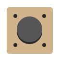
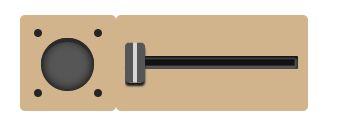
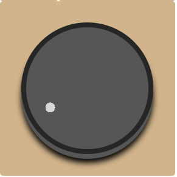
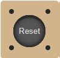
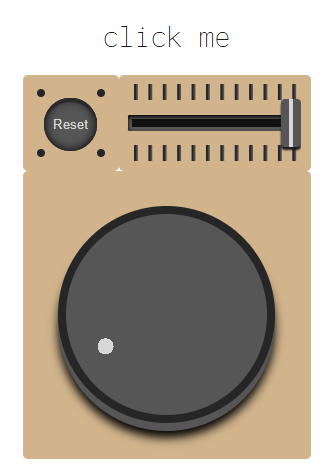
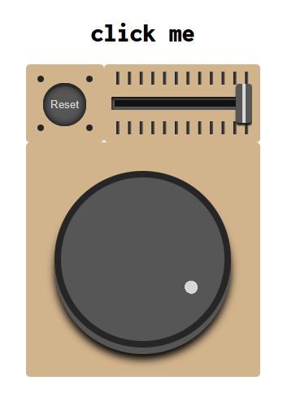
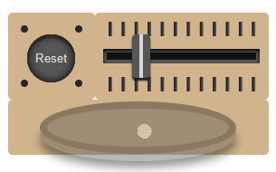

# CSS to the rescue
CSS to the Rescue repository | Quy Nguyen

**Opdracht:** control panel

<details>
<summary><h2>Week 1</h2></summary>

### Doel
Het doel deze week, was om een opdracht te kiezen en een idee uit te werken en mischien een beginnetje te maken. ik heb hier veel moeite mee gehed omdat de opdracht die ik wou doen veel mogelijkheden gaf en ik niet goed wist wat ik wou maken.

### Voortgang
Ik ben in deze week nog niet op ideeën gekomen. Ik weet wel dat ik graag een control apnel wil maken die veel verschillende soorten indteracties heeft omdat het mij uitdagend lijkt om verschillende soorten interecties te maken(buttons, sliders, draaiknoppen etc). 

Ik weet alleen nog niet in welke context ik fhet control panel wil maken. Waar heeft het controle over? wat moet er gebeuren op basis van de interactie met de control panel?
</details>

<details>
<summary><h2>Week 2</h2></summary>

### Doel

Deze week is het doel om gewoon te beginnen aan de interecties die is sowieso wil gaan maken. Waar deze interacties contole over hebben moet ik nog bedenken.

### Voortgang
Tijdens het maken van een knop ben ik op het idee gekomen om een control panel te maken die zichzelf uit klapt als je op alle interacties Die je doet. 

<h4>styling:</h4>

Ik ben deze week aan de html begonnen met een button en een slider die onder de button vandaan komt als je er op hebt gedrukt. ik heb gebprobeerd de knop zo stylen dat ik dezefde soort styling (kleuren, vormen, ruimte tussen elementen) ook toegepast kan worden op de andere interacties. Dit heb ik gedaan door gebruik te maken van custom properties en door eigenschappen zoals de achtergrondkleur en border-radius hoog in de hiërarchie te zetten.

  <details>
  <summary><h4>styling code</h4></summary>
    
```
body{
    --standard-width:6em;
    --animation-duration:1.1s;
    --interaction-color:rgb(86, 86, 86);
    --module-color:tan;
    --detail-color:rgb(37, 38, 37);
}

fieldset {
    border: 0;
    padding: 0;
    margin: 0;
    border-radius: 5px;
    display: flex;
    justify-content: center;
    align-items: center;
    background: var(--module-color);
}
```
</details>

<h4>knop:</h4>

Ik heb de eerste knop gemaakt met een checkbox waarbij ik de styling weg heb gehaald. De styling voor de knop heb ik op een `:before` element gezet. De animatie van de knop heb ik gemaakt door de margin en :before te stylen bij valid. De "schroefjes" die ik heb toegevoegd als detail voor de knop heb ik gedaan door middel van `box-shadow` op de parent.


  <details>
  <summary><h4>knop code</h4></summary>

```
    position: absolute;
    cursor: pointer;
    appearance: none;
    display: flex;
    justify-content: center;
    margin-bottom: 4px;
    transition: margin-bottom 0.3s ease-in-out;
    
    &::before {
        content: "";
        width: 4em;
        height: 4em;
        border-radius: 50%;
        background-color: var(--interaction-color);
        box-shadow: 0px 4px 0px rgb(42, 42, 42);
        transition: 0.3s ease-in-out;
    }  
```
</details><details>
<summary><h4>knop animatie code</h4></summary>
  
```
    &:valid{
        margin-bottom: 0;
    }

    &:valid::before {
        box-shadow: 0px 0px 0px rgb(42, 42, 42), inset 0 4px 0px rgb(42, 42, 42),inset 0 0 10px black;
        transform: translateY(2px);
    }
```
</details><details>
<summary><h4>knop details code</h4></summary>
  
  ```
    &::before {
         content: "";
         position: absolute;
         width: 8px;
         height: 8px;
         border-radius: 50%;
         box-shadow: 30px 30px rgb(37, 38, 37), -30px 30px rgb(37, 38, 37), 30px -30px rgb(37, 38, 37),-30px -30px rgb(37, 38, 37);
     }
  ```
</details>

<h4>slider:</h4>

Ook heb ik deze week tijd gestopt in uitzoeken hoe je een range input kan stylen dat ook is gelukt. Ik heb de javascript die ik mag gebruiken voor het ophalen van de waarde van de range inputs in het project geplakt. Om de animatie te maken dat de slider onder de knop vandaan komt wanneer er op de knop wordt gedrukt, heb ik de slider onder de knop gezet met `translateX(-100%)` en als de checkbox valid is de translate op 0 gezet. Ik heb geleerd hoe je de slider moet stylen door [dit artikel](https://css-tricks.com/styling-cross-browser-compatible-range-inputs-css/).


<details>
<summary><h4>slider styling code</h4></summary>
  
  ```
fieldset:nth-of-type(2) input[type="range"]{
     -webkit-appearance: none;
     position: fixed;
     background: transparent;
     width: 4em;
     height: 1em;
     transition: width var(--animation-duration) ease-in-out, transform var(--animation-duration) ease-in-out;
 
     &::-webkit-slider-thumb {
         -webkit-appearance: none;
         background: rgb(215, 215, 215);
         border: solid var(--interaction-color);
         border-width: 0px 8px;
         cursor: pointer;
         border-radius: 4px;
         height: 4em;
         width: 20px;
         margin-top: -1.5em;
     }
 
     &:focus {
         outline: none;
     }
 
     &::-webkit-slider-runnable-track {
         width: 100%;
         height: 1em;
         cursor: pointer;
         background: #1d1d1d;
         border-radius: 2px;
         cursor: pointer;
     }
 
     &:focus::-webkit-slider-thumb{
         box-shadow: rgba(0, 0, 0, 1) 0px 2px 5px;
     }
 }
  ```
</details><details>
<summary><h4>slider amimatie code</h4></summary>
  
  ```
form:nth-of-type(1):has(input[type="checkbox"]:invalid) fieldset:nth-of-type(2) {
     z-index: -1;
 }
 
 form:nth-of-type(1):has(input[type="checkbox"]:valid) fieldset:nth-of-type(2) {
     width: calc(var(--standard-width)*2);
     height: var(--standard-width);
     transform: translateX(0);
     animation: setZIndex 0s linear var(--animation-duration) forwards;
 }
 
 form:nth-of-type(1):has(input[type="checkbox"]:valid) input[type="range"]{
     width: 9em;
     cursor: pointer;
 }
  ```
</details>
<h4>Draaiknop:</h4>
Als laatste ben ik ook begonnen met het maken van de draaiknop die ik onder de knop en slider vandaan wil laten komen op basis van de positie van de slider. Ik heb dit gedaan door de width en de height te berekenen met de custom property dat uit de slider komt. Ook hier beweeg ik de knop naar beneden door `translateY` te gebruiken.
<details>
<summary><h4>draaiknop animatie code</h4></summary>
  
  ```
    width: calc(var(--standard-width) * (1 + 2 * var(--slider)));
     height: calc(var(--standard-width) * (1 + 2 * var(--slider)));
     transform: translateY(calc(-100% + 100% * var(--slider)));
  ```
</details>

### Volgedne week
ik ga volgende week uitzoeken hoe ik een functionele draaiknop kan maken in CSS en hoe ik die kan stylen. Ook wil ik meer details toevoegen aan mijn slider door strepen aan de zijkant van de slider te plaatsen, ik moet nog uitzoeken hoe ik dit het beste kan doen.
</details>

<details>
<summary><h2>Week 3</h2></summary>

### Doel

Deze is mijn doel om een werkende draaiknop te krijgen en meer detail toe te voegen aan de bestaande interacties.

### Voortgang

<h4>knop:</h4>

Om beter te laten zien dat de knop is ingedrukt heb ik een shadows gamaakt aan de binnenkant van de knop als hij ingedrukt is.


<details>
<summary><h4>knop details code</h4></summary>
  
  ```
        box-shadow: 0px 0px 0px rgb(42, 42, 42);
         box-shadow: 0px 0px 0px rgb(42, 42, 42), inset 0 4px 0px rgb(42, 42, 42),inset 0 0 10px black;
  ```
</details>

<h4>slider:</h4>

Ik heb bij de slider meer details toegevoegd door tickmarks bij te zetten en door de track te laten lijken op een gleuf waar de thumb doorheen gaat. ik heb dit gedaan met behulp van een codepen van [Ana Tudor](https://codepen.io/wqsuasrc-the-looper/pen/emYELqz?editors=0100). Hier gebruikt zij een `background` met een `gradient` met een repeat zodat er meerder strepen op de achtergrond komen. Ook heb ik hier instpiratie van gehaald door een shadows in de track doen voor een 3d effect.


<details>
<summary><h4>slider details code</h4></summary>
  
  ```
 background: 
   linear-gradient(90deg, var(--detail-color) 1.5px, transparent 0),
   linear-gradient(90deg, var(--detail-color) 1.5px, transparent 0),
   linear-gradient(90deg, var(--interaction-color) 3px, transparent 0), 
   linear-gradient(90deg, var(--interaction-color) 3px, transparent 0) ;
   background-clip:content-box;
   background-position: 6px 100%,6px 0px,7px 0px,7px 100%;
   background-repeat: repeat-x;
   background-size: 1em 1em;
 	 background-color: currentcolor;
 	 color: transparent;
   font-size: 1em;

    &::-webkit-slider-runnable-track {
         width: 100%;
         height: 1em;
         cursor: pointer;
         background: #121212;
         border-radius: 2px;
         cursor: pointer;
         box-shadow: inset 0 .125em .25em #000000, inset 0 0 0 .25em var(--interaction-color);
  ```
</details>

<h4>draaiknop:</h4>

Deze week heb ik met behulp van de [sin/cos workshop](https://codepen.io/shooft/pen/OPJxyQW) van Sanne de draaiknop werkend kunnen maken. hierbij heb ik geleerd hoe je een radial gradiant kan positioneren op basis van de waarde van de range input. De details van de draaiknop staan in het label. Doordat de draaiknop onder de andere elementen vandaan komt en dus een negatieve `z-index` heeft, kan je er geen interactie mee hebben. Om dit op te lossen heb ik de `z-index` ook laten aanpassen op basis van de slider zoals de height animatie.


<details>
<summary><h4>draaiknop code</h4></summary>
  
  ```
label[for="dial"]{
     display: flex;
     position: relative;
     justify-content: center;
     align-items: center;
     border-radius:50%;
 	width: calc(var(--slider)*12em);
 	height: calc(var(--slider)*12em);
 	background: var(--interaction-color);
     box-shadow: 0px 8px 1px rgb(42, 42, 42);
     border: solid 8px var(--detail-color);
     box-shadow: 0px 8px 0px var(--interaction-color), 0px 15px 10px black;
 
     &::before{
     content:"";
 	position:absolute;
 	inset:0;
 
     --angle:120deg;
 	--angle-thumb:calc( var(--angle) * -1 + var(--angle) * 2 * var(--dial) );
 
 	background-image:
 		radial-gradient(
 			circle at 
 				calc(50% + sin(var(--angle-thumb)) * (12em * calc(.4 * var(--slider)) - 1em * .5) ) 
 				calc(50% - cos(var(--angle-thumb)) * (12em * calc(.4 * var(--slider)) - 1em * .5) ),
 			var(--detail-color) calc(1em * .5),
                 rgb(215, 215, 215) calc(1em * .5),
 			transparent 0
 		);
     }
  ```
</details>
<details>
<summary><h4>draaiknop animatie code</h4></summary>
  
  ```
 z-index: calc( -2 + (var(--slider) * 1.51) );
     width: var(--standard-width);
     height: calc(var(--standard-width) * (1 + 2 * var(--slider)));
     transform: translateY(calc(-100% + 100% * var(--slider)));
  ```
</details>

<h4>switches:</h4>

Deze week wou ik nog een begin maken aan een interactie die onder de draaiknop vandaan komt. Het idee was hier om een aantal toggle switches te maken die iets doen als je ze allemaal hebt geactiveerd. Deze form komt tevoorschijn op basis van de waarde van de draaiknop.
<details>
<summary><h4>switches code</h4></summary>
  
  ```
form:nth-of-type(3) {
     display: flex;
     position: relative;
     z-index: calc( -2 + (var(--dial) * 1.51) );
     justify-content: center;
     align-items: center;
     width: calc(var(--standard-width) * 3);
     height: var(--standard-width);
     transform: translateY(calc(-100% + 100% * var(--dial)));
     /* transform: translateY(calc(-100% + 100% * var(--dial) + -100% + 100% * var(--slider))); */
     transform-origin: top;
     border-radius: 5px;
     background: var(--module-color);
     transition: width var(--animation-duration) ease-in-out;
 }
  ```
</details>

### Volgedne week
Ik kwam er deze week achter dat als je alles probeert te resetten door weer op de eerste knop te drukken, de waarde van de slider niet terug gaat. Tijdens het feedback gesprek kreeg ik te horen dat dat wel kan als ik de checkbox vervang met een reset knop als de checkbox actief is. Hiervoor moet ik alle interacties in één form doen in plaats van voor elke interactie een aparte form maken. Ik wil ook nog iets doen met typografie. 

Verder zou ik me willen verdiepen hoe ik de interacties anders kan positioneren dan transform: translate, ik zit er over na te denken om een grid te gebruiken waarbij elke interactie zijn eigen hoekje geef en de hoogte en breedte in eerste instantie op 0fr te zetten. op deze manier hoef ik alleen de hoogte en breedte van de interacties aan te passen in plaats van het precentage van de translate.
</details>
<details>
<summary><h2>Week 4</h2></summary>

### Doel

Deze week ga ik het project afmaken. Mijn belangrijkste doel is om het voor elkaar te krijgen dat de reset knop werkt. Ik denkt dat het gaat lukken om iets met typografie te doen en grid te gebruiken in plaats van translate.

### Voortgang

**Reset knop:**
Om een reset knop te implementeren is het nodig om alle interacties in één form te doen. Als de checkbox van de eerste knop actief is moet de checkbox verdwijnen en de reset knop naar voren komen met dezelfde styling.


<details>
<summary><h4>html opbouw</h4></summary>
  
  ```
<body>
    <main>
        <h1>click me</h1>
        <form>
            <fieldset>
                <label for="firstbutton">
                    <input type="checkbox" name="firstbutton" required>
                </label>
                <label>
                    <input type="reset">
                </label>
            </fieldset>
            <fieldset>
                <label for="slider">
                    <input type="range" min="0" max="1" step="0.01" value="0">
                </label>
            </fieldset>
            <fieldset>
                <label for="dial">
                    <input type="range" min="0.01" max="1" step="any" value="0" name="dial">
                </label>
            </fieldset>
        </form>
    </main>
</body>
  ```
</details>

<details>
<summary><h4>reset knop code</h4></summary>
  
  ```
fieldset:nth-of-type(1) input[type="reset"] {
     color: rgb(215, 215, 215);
     padding: 0;
     border: none;
     position: absolute;
     visibility: hidden;
     width: 4em;
     height: 4em;
     border-radius: 50%;
     background-color: var(--interaction-color);
     box-shadow: 0px 0px 0px rgb(42, 42, 42), inset 0 4px 0px rgb(42, 42, 42),inset 0 0 10px black;
     transition: 0.3s ease-in-out;
 }
 
 @keyframes resetbutton {
     1%, 99%{
         visibility: hidden;
     }
 
     100% {
         visibility: visible;
     }
 }
 
 fieldset:nth-of-type(1):has(input[type="checkbox"]:checked) input[type="reset"]{
     animation: resetbutton 0.3s linear forwards;
     margin-top: 4px;
 }
  ```
</details>

<h4>slider reset:</h4>
Met de resset knop wordt de positie van de slider weer naar het begin gezet maar de waarde van de custom property dat gekoppeld is aan de slider wordt niet op 0 gezet. Sanne heeft me een codepen gestuurd waar er een waarde uit de slider wordt gehaald zonder JS. 
<br>
<br>
Deze code zorgt ervoor dat de slider `(input[type="range"])` automatisch animatie afspeelt op basis van hoe ver je de thumb schuift. De variabele `--rangePercentageValue` wordt geüpdatet van max naar min wanneer de slider beweegt en de view-timeline `(--rangePercentage)` koppelt de voortgang van de thumb aan een animatie. Hierdoor kan ik --rangePercentageValue gebruiken om de volgende interactie te animeren. Deze waarde wordt ook gereset met de reset knop omdat de positie van de thumb naar 0 gaat en `--rangePercentageValue` dus ook.
<details>
<summary><h4>nieuwe slider code</h4></summary>
  
  ```
    timeline-scope: --rangePercentage;
     animation: --rangePercentageAni linear both;
     animation-timeline: --rangePercentage;
     animation-range: entry 100% exit 0%;

@property --rangePercentageValue {
     syntax: "<number>";
     inherits: true;
     initial-value: 0; 
   }

@keyframes --rangePercentageAni {
     0% {--rangePercentageValue: 1}
     100% {--rangePercentageValue: 0}
   }
 }

fieldset:nth-of-type(2) input[type="range"]{
  overflow: hidden;
  view-timeline: --rangePercentage inline;
}
  ```
</details> 

<h4>font control:</h4>
Nadat ik de reset knop werkend kreeg kwam ik er achter dat het niet meer mogelijk is om nog een interactie toe te voegen. Ik had wel iets nodig dat je kan bedienen met de draaiknop. uiteindelijk heb ik ervoor gekozen om een titel te maken waarvan de font-weight aangepast wordt door de draaiknop.


<details>
<summary><h4>font control code</h4></summary>
  
  ```
h1{
     font-family: "Inconsolata", monospace;
     font-weight: calc(900*var(--dial));
 }
  ```
</details> 

<h4>draaiknop container:</h4>
momenteel kan je de draaiknop nog zien wanneer de fieldset op een hoogte van 0fr zit. Ik heb dit opgelost met een container query. wanneer de container kleiner wordt dan dat de draaiknop hoog is zal hij langzaam verdwijnen door de oppacity te controleren met de waarde van de slider en display op none te setten als de container klein genoeg is. <br>


<details>
<summary><h4>draaiknop container code</h4></summary>
  
  ```
fieldset:nth-of-type(3) {
    container-type: size;
    container-name: dial;

    label[for="dial"]{
        opacity: calc(200% * var(--rangePercentageValue));
  }
}

@container dial (max-height: 2em){
     fieldset:nth-of-type(3) label[for="dial"] {
         display: none;
     }
 }
  ```
</details> 
</details>
<details>
<summary><h2>Bronnen</h2></summary>
-[range input styling](https://css-tricks.com/styling-cross-browser-compatible-range-inputs-css/)<br>
-[Ana Tudor's slider](https://codepen.io/wqsuasrc-the-looper/pen/emYELqz?editors=0100)<br>
-[sin/cos workshop](https://codepen.io/shooft/pen/OPJxyQW)<br>
-[codepen](https://codepen.io/shooft/pen/emYzEra)
</details>
